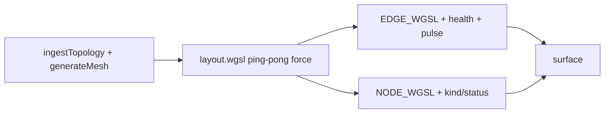

# GPUNetworkTopology Design

**Date:** 2026-08-31  
**Status:** Approved for implementation planning  
**PLAN.md:** #17 — GPU network topology (102.0)

## Goal

An infra / service-mesh schematic viewer: force-directed layout on the GPU with continuous settle, domain visuals for node kind/status and link health/traffic (including an edge traffic pulse). Playground-first; **not** shipped via the copy-source CLI until the shared force-layout animation defect is fixed.

## Locked decisions

| Topic | Choice |
|-------|--------|
| Product shape | Infra / service mesh schematic (not geo map, not package DAG) |
| Layout | GPU force layout with continuous settle |
| Relationship to `GPUGraph` | Local fork under `registry/networktopology/`; leave `GPUGraph` as-is |
| Distribution | Playground + tests only — **omit** from `buildRegistry.mjs` (same exclusion rationale as `GPUGraph`) |
| Domain encoding | Kind + status + link health + traffic pulse |
| Demo scale | Dual modes: schematic (~300) and stress (~4k) |
| Core changes | None in v1 |
| Hover | None in v1 (GPU-only positions; needs `Picker`) |

## Approach (chosen)

**Local fork of the graph pipeline** in `registry/networktopology/`:

- Reuse the force-layout compute pattern (`pingPongStorage`, CSR adjacency, iteration cap).
- Extend node/edge render shaders for kind, status, health, traffic, and pulse.
- Domain ingest + generators + React wrapper + site demo.

Rejected alternatives:

1. **React-only facade on `GPUGraph`** — cannot deliver link health / pulse without shader work.
2. **Extend `registry/graph` first** — couples this feature to fixing/shipping graph; higher blast radius.

## Architecture



- Positions live only on the GPU; layout writes, render reads — no per-frame CPU readback.
- `animating = true` until iteration cap / pause (same scheduler contract as `GPUGraph`).
- Edge geometry cannot use `LineLayer` (CPU-mirrored instances); keep instanced thick-line quads driven by GPU position storage.

## Data model & API

```ts
type NodeKind = "region" | "az" | "service" | "pod" | "host"
type NodeStatus = "up" | "degraded" | "down"

ingestTopology({
  nodes: { id?, label?, kind, status }[],
  edges: { source, target, health: 0..1, traffic: 0..1 }[],
  seed?: number,
}): TopologyData

generateMesh({ mode: "schematic" | "stress", seed? }): TopologyData

<GPUNetworkTopology
  data={data}
  viewport={viewport}
  onViewportChange={...}
  paused?
  selectedNode?
  onIterate?
  pulseSpeed?   // default 1
  aria-label?
/>
```

`TopologyData` includes the graph fields needed for layout (positions seed, edges, CSR adjacency, nodeCount, edgeCount) plus:

- `kind: Uint8Array` (encoded enum)
- `status: Uint8Array` (encoded enum)
- `edgeHealth: Float32Array`
- `edgeTraffic: Float32Array`
- `labels?: readonly string[]`

**Validation:** positive node count; out-of-range edge endpoints dropped and counted (mirror `ingestGraph`); clamp health/traffic to `[0, 1]`. Warn (do not hard-fail) above the recommended ~5k node ceiling for O(n²) repulsion.

**Generators:**

- `schematic` ≈ 300 nodes — region → AZ → service → pod hierarchy with a few degraded/down nodes and unhealthy/hot links; labels useful.
- `stress` ≈ 4k nodes — denser random-ish mesh; labels off or roots only in the demo.

## Visuals & interaction

**Nodes**

- Kind → size (region largest → pod smallest).
- Status → tint: up = category palette; degraded = amber mix; down = red + lower alpha.
- Selected → brighter / slightly larger (`selectedNode` prop only).

**Edges**

- Width scales with `traffic`.
- Color from `health` (green → amber → red).
- Pulse: fragment uses `fract(along + time * speed * traffic)` so hot links shimmer; cold/down links stay static/dim.

**Interaction**

- Pan, wheel zoom, pause — mirror `GPUGraph`.
- `onIterate(iterations, settled)` for settling readout.
- No hit-test / hover in v1 (`hitTest` returns null with the same honesty as graph).
- Schematic: capped `LabelOverlay` (~80–120). Stress: labels off or roots only.
- A11y: live settling/settled summary; node/edge/status counts.

## File layout

| File | Role |
|------|------|
| `registry/networktopology/ingest.ts` | `ingestTopology`, packing, caps |
| `registry/networktopology/generate.ts` | `generateMesh` schematic / stress |
| `registry/networktopology/layout.wgsl.ts` | Force layout compute (from graph) |
| `registry/networktopology/topology.wgsl.ts` | Node + edge render shaders |
| `registry/networktopology/NetworkTopologyComponent.ts` | Upload, iterate, plan/draw |
| `registry/networktopology/GPUNetworkTopology.tsx` | Viewport, pause, labels, a11y |
| `registry/networktopology/index.ts` | Public exports |
| `*.test.ts` / `render.pixels.test.ts` | Ingest, component, Dawn smoke |

## Wiring

- Add `registry/networktopology/*.test.ts` to root `test:registry`.
- **Do not** add `networktopology` to `packages/cli/scripts/buildRegistry.mjs`.
- Site: `NetworkTopologyDemo`, `/playground/networktopology`, playground index card.
- Matrix: `GPUNetworkTopology` tag → `p7`.
- Demo UI: schematic / stress toggle, pause, settling readout, status legend.

## Testing

- Ingest packs kind/status/health/traffic; clamps; drops bad endpoints.
- Generators are deterministic for a fixed seed; schematic vs stress sizes differ as specified.
- Component: `animating` while iterating; plan includes layout compute + edge/node draws; `hitTest` is null.
- Dawn: non-black pixels after N iterations (same class of smoke as `GPUGraph`).
- Explicit note in demo/footnote: browser animation may still share the known `GPUGraph` settle defect.

## Out of scope (v1)

- CLI / registry.json ship
- Fixing `GPUGraph` animation
- Async GPU `Picker` / hover
- Editing (add/remove nodes or edges)
- Geographic / lon-lat layout
- Curved edges, edge labels, collapse/expand tiers
- Live streaming topology diffs (full `data` replace only)

## Success criteria

1. Playground page renders schematic and stress modes with distinct node/edge styling and a visible traffic pulse on hot links (when the device animates).
2. Registry + site typecheck clean; topology tests green (Dawn skipped if unavailable).
3. Component remains absent from the CLI registry bundle.
4. No `@gpuc/core` API changes.
