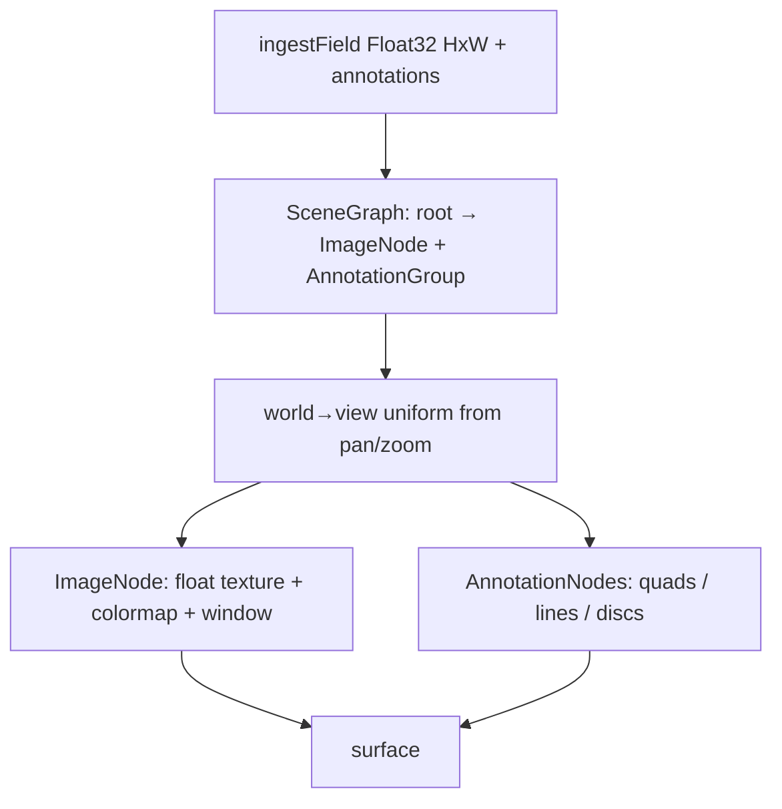

# GPUAnnotationCanvas Design

**Date:** 2026-09-01  
**Status:** Approved for implementation planning  
**PLAN.md:** #11 — GPU annotation canvas (image + overlays) (99.0)

## Goal

A medical / scientific annotation canvas: one large Float32 field rendered through a colormap with windowing, plus a retained GPU scene graph of measurement overlays (rect, ellipse, point, ruler, polygon, freehand). Hybrid interaction — annotations arrive via props; draw/edit tools emit events; the host owns persistence. Playground-only in v1 (not shipped via the CLI registry).

## Locked decisions

| Topic | Choice |
|-------|--------|
| Product shape | Medical / scientific (not CV labeling UI, not screenshot markup) |
| Overlays | Rect, ellipse, point, ruler, freehand/polygon + length/area readouts |
| Interaction | Hybrid — props + tools → `onCreate` / `onChange` / `onDelete` |
| Image | Float32 scientific array + colormap + display window `[min, max]` |
| Scale | Large single texture within device limits (aim ≤8192); no pyramid tiling in v1 |
| Architecture | GPU vector scene graph (image + annotations share one transform stack) |
| Distribution | Playground + tests only — **omit** from `buildRegistry.mjs` |
| Core | Prefer zero `@gpuc/core` API changes; scene types live in the component |

## Approach (chosen)

**Full vector scene graph on the GPU** — retained `SceneNode` tree with local transforms; `ImageNode` samples the float field; `AnnotationNode`s draw as instanced quads / thick lines / discs. Rejected alternatives:

1. **ImageDiff texture + flat overlay layers** — simpler, but user chose the scene-graph shape for a shared transform / editing model.
2. **Canvas2D overlay on a GPU image** — easy tools, breaks the one-device / one-frame story.

**v1 bound on “scene graph”:** `Root → ImageNode | AnnotationGroup → AnnotationNode[]`. No deep arbitrary nesting, no general scene package.

## Architecture



- Shared viewport in **image space** (pixel coordinates of the field).
- Hit-test on CPU against annotation geometry (CPU-mirrored scene); field is not pickable except as draw placement.
- Measurement labels via DOM `LabelOverlay` (same a11y path as other components), capped ~100.

## Data model & API

```ts
type AnnotationKind = "rect" | "ellipse" | "point" | "ruler" | "polygon" | "freehand"

type Annotation = {
  id: string
  kind: AnnotationKind
  // image-space: rect/ellipse x,y,w,h | point x,y | ruler x0,y0,x1,y1
  // polygon/freehand: points: {x,y}[]
  label?: string
  color?: number
}

ingestField({
  width, height,
  values: Float32Array, // length === width * height
  window?: { min, max },
}): FieldData

<GPUAnnotationCanvas
  field={field}
  annotations={annotations}
  tool?: "pan" | "select" | "rect" | "ellipse" | "point" | "ruler" | "polygon" | "freehand"
  colormap?: "viridis" | "magma" | "gray" | …
  window?: { min, max }
  viewport / onViewportChange
  selectedId? / onSelect?
  onCreate?: (a: Annotation) => void
  onChange?: (a: Annotation) => void
  onDelete?: (id: string) => void
  aria-label?
/>
```

**Caps (policy in component source):** max dimension from device caps (document ~8192); max annotations ~2 000; freehand/polygon ≤ ~256 vertices each.

## Visuals, tools & interaction

**Image:** Float32 → GPU texture (`r32float` or equivalent supported format); fragment applies colormap LUT and window mapping.

**Annotations:** stroked/filled rect & ellipse; point discs; ruler segment; polygon/freehand polylines (closed polygon may fill lightly). Selection = brighter stroke + handle quads.

**Measurements (DOM):** ruler → length; rect/ellipse/polygon → area (rect also shows w×h).

**Tools:** pan; select + move; draw-by-drag for rect/ellipse/ruler/point; polygon click-to-add, double-click/Enter to close; freehand sample-on-move then simplify to vertex cap. Delete selected → `onDelete`.

**A11y:** live summary (field size, window, counts by kind); announce selected annotation + measurement.

## File layout

| File | Role |
|------|------|
| `registry/annotationcanvas/scene.ts` | Scene graph, transforms, hit-test |
| `registry/annotationcanvas/ingest.ts` | `ingestField`, validation |
| `registry/annotationcanvas/measure.ts` | Length/area oracles |
| `registry/annotationcanvas/field.wgsl.ts` | Field + colormap + window |
| `registry/annotationcanvas/annotations.wgsl.ts` | Shape shaders |
| `registry/annotationcanvas/AnnotationCanvasComponent.ts` | Upload, plan, draw |
| `registry/annotationcanvas/GPUAnnotationCanvas.tsx` | Tools, viewport, labels, a11y |
| `registry/annotationcanvas/tools.ts` | Pointer → annotation drafts |
| `*.test.ts` / `render.pixels.test.ts` | Unit + Dawn smoke |

## Wiring

- Add `registry/annotationcanvas/*.test.ts` to root `test:registry`.
- **Do not** add to `packages/cli/scripts/buildRegistry.mjs`.
- Site: `AnnotationCanvasDemo`, `/playground/annotationcanvas`, playground index card.
- Matrix: `GPUAnnotationCanvas` → `p7`.
- Demo: synthetic Float32 field (browser-friendly size, e.g. 1024–2048²), tool palette, window slider, seed annotations.

## Testing

- Ingest rejects mismatched length / non-positive size; default window from finite min/max.
- Measure matches CPU oracles for length/area.
- Scene add/update/remove; hit-test prefers topmost annotation.
- Component plan: field then annotations; no unbounded compute.
- Dawn: non-black field pixels; at least one annotation contributes lit pixels.

## Out of scope (v1)

- CLI / registry.json ship
- DICOM, multi-channel, z-stacks, tiled pyramids
- Deep nested scene package / general editor framework
- Collaborative sync, undo stack (host may implement via props)
- Curved Bezier tools, text callouts as GPU glyphs

## Success criteria

1. Playground shows a colormapped Float32 field with pan/zoom/window and drawable annotations that round-trip through host state via events.
2. Registry + site typecheck clean; annotationcanvas tests green (Dawn skipped if unavailable).
3. Component absent from the CLI registry bundle.
4. No required `@gpuc/core` API changes (or explicitly justified minimal ones only if texture helpers are missing — prefer component-local).
